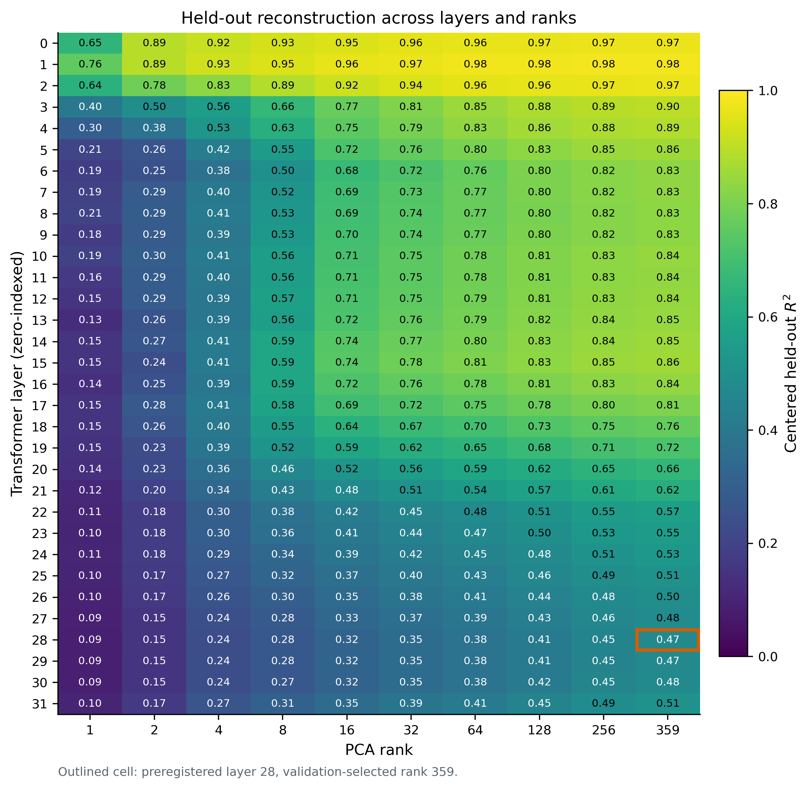
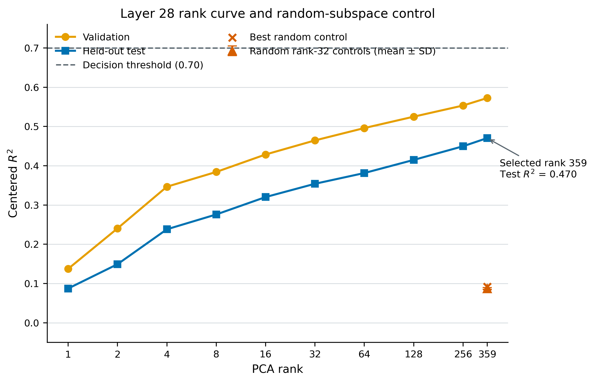

# Alignment Manifold

Alignment Manifold tests whether activation changes between post-training
checkpoints form a compact shared subspace, require prompt-conditional
trajectories, or exhibit useful local/nonlinear geometry. It also tests whether
compressed activation changes remain causally active when inserted into the
parent checkpoint.

The central result is deliberately mixed:

- **Supported:** activation changes follow a strong prompt-conditional path
  through training time.
- **Not supported:** the tested late-layer changes do not collapse into a
  compact rank-32 subspace shared across prompts.
- **Not supported:** the tested local and nonlinear alternatives do not provide
  a convincing improvement over the linear baselines.

This distinction matters for alignment research. A representation can be
predictable along training time without being governed by one small, universal
steering manifold.

## Main 7B Result

The primary experiment compares pinned OLMo 2 7B DPO and RLVR checkpoints at
steps 60, 180, and 360. Layer 28 was preregistered as a relative-depth analogue
of the causally selected layer in the earlier 1B experiment.

| Test | Held-out result | Interpretation |
| --- | ---: | --- |
| Prompt-conditional temporal interpolation | R2 = 0.8465 | Supported |
| Shared rank-32 trajectory subspace | R2 = 0.3541 | Not supported |
| Extended-rank recovery | No compact recovery | Not supported |
| Local/nonlinear advantage | No reliable improvement | Not supported |

Exact machine-readable values are included in [`results/`](results/). The full
methods, registered decision rules, robustness checks, supported claims,
unsupported claims, and limitations are in
[`reports/TRAJECTORY_7B_RESULTS.md`](reports/TRAJECTORY_7B_RESULTS.md).





## Earlier 1B Results

The earlier 1B endpoint smoke experiment found a causally concentrated
rank-16/32 linear subspace at layer 14, without evidence that local or nonlinear
geometry was superior. A three-snapshot 1B trajectory experiment then found
strong prompt-conditional interpolation (R2 = 0.960) but weak compact shared
rank-32 reconstruction (held-out R2 = 0.506).

These results are documented in:

- [`reports/SMOKE_RESULTS.md`](reports/SMOKE_RESULTS.md)
- [`reports/TRAJECTORY_RESULTS.md`](reports/TRAJECTORY_RESULTS.md)

## Research Discipline

The project uses explicit decision rules:

- Compact reconstruction without causal recovery is treated as readout
  geometry, not a causal mechanism.
- A local or nonlinear interpretation requires held-out improvement over
  simpler linear baselines.
- Failure of compact reconstruction is reported as evidence against the tested
  shared-subspace hypothesis, not proof against every possible nonlinear
  description.
- Positive temporal interpolation is kept separate from the unsupported compact
  manifold claim.

## Repository Contents

```text
configs/                 Pinned experiment configurations
data/                    Synthetic deterministic evaluation prompts
reports/                 Full methods and result reports
reports/figures_7b/      Publication-format 7B figures
results/                 Compact machine-readable result snapshots
scripts/                 Robustness, calibration, causal, and figure analyses
src/alignment_manifold/  Extraction, geometry, trajectory, and causal code
tests/                   Focused unit tests
```

Model weights, activation arrays, caches, and checkpoints are intentionally not
redistributed.

## Installation

Python 3.10 or newer is required.

```powershell
python -m venv .venv
.\.venv\Scripts\Activate.ps1
python -m pip install --upgrade pip
python -m pip install -e ".[dev,viz]"
pytest -q
```

The release test suite contains ten tests covering prompt generation,
trajectory metrics, geometry, and causal metrics.

## Reproduction

Start with the low-cost smoke configuration:

```powershell
$env:HF_TOKEN = Read-Host -MaskInput "Hugging Face token"
alignment-manifold prompts build --config configs/smoke.yaml
alignment-manifold extract --config configs/smoke.yaml --checkpoint sft
alignment-manifold extract --config configs/smoke.yaml --checkpoint dpo
alignment-manifold geometry --config configs/smoke.yaml
alignment-manifold causal --config configs/smoke.yaml
Remove-Item Env:HF_TOKEN
```

The 7B configurations use sequential checkpoint loading and pinned model
revisions. They require substantially more download, storage, and compute than
the unit tests. See [`REPRODUCIBILITY.md`](REPRODUCIBILITY.md) before attempting
the full run.

## Data and Privacy

The prompt files are generated deterministically by
`src/alignment_manifold/prompts.py`. They are synthetic evaluation prompts, not
user conversations or incident records. They contain helpfulness, honesty,
instruction-following, and safety pairs. Manifests record their hashes and
generation seed.

## Models and Attribution

The experiments use external OLMo 2 checkpoints developed by Ai2. Repository
IDs and resolved revisions are pinned in the configurations and provenance
manifests. This repository does not redistribute those weights. Consult the
official model cards and responsible-use terms before downloading them:

- https://huggingface.co/allenai/OLMo-2-1124-7B-DPO
- https://huggingface.co/allenai/OLMo-2-1124-7B-Instruct

Personal contributions and external dependencies are described in
[`CONTRIBUTIONS.md`](CONTRIBUTIONS.md).

## Status

This is a research release. It supports the reported experiments and their
audit trail; it is not a production steering library and does not claim a
general solution to post-training interpretability or alignment.
