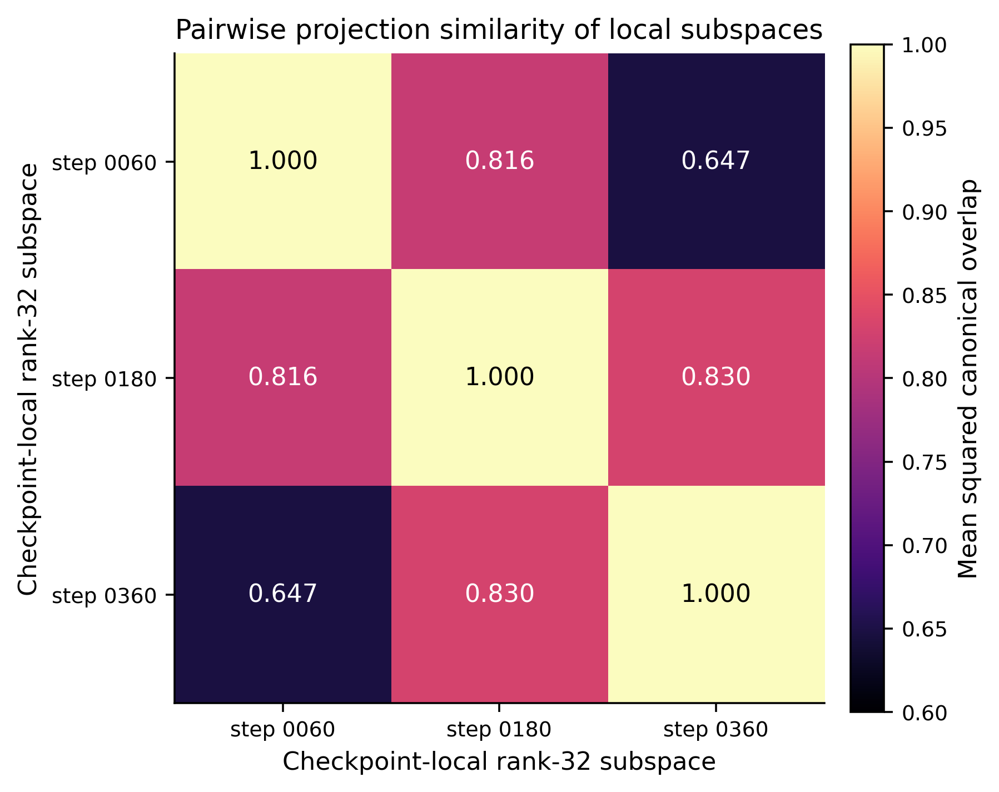
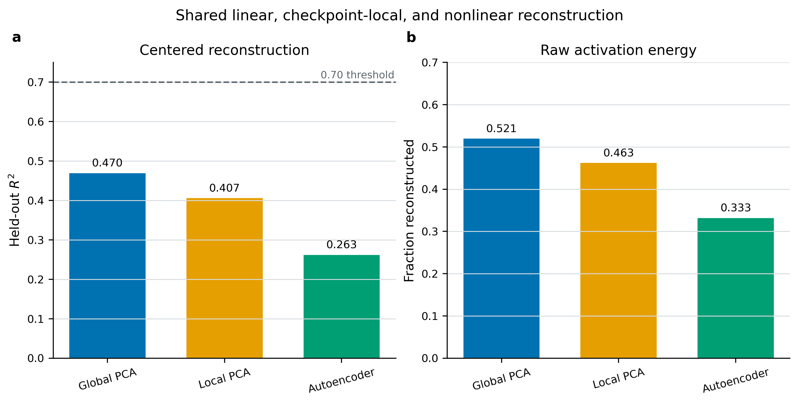
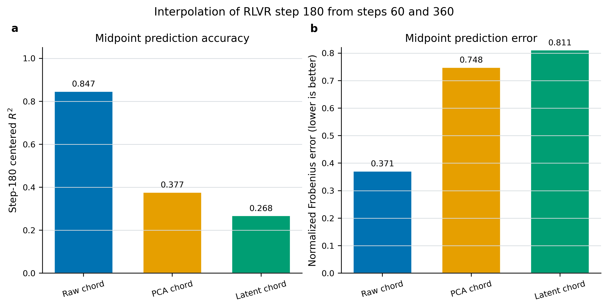
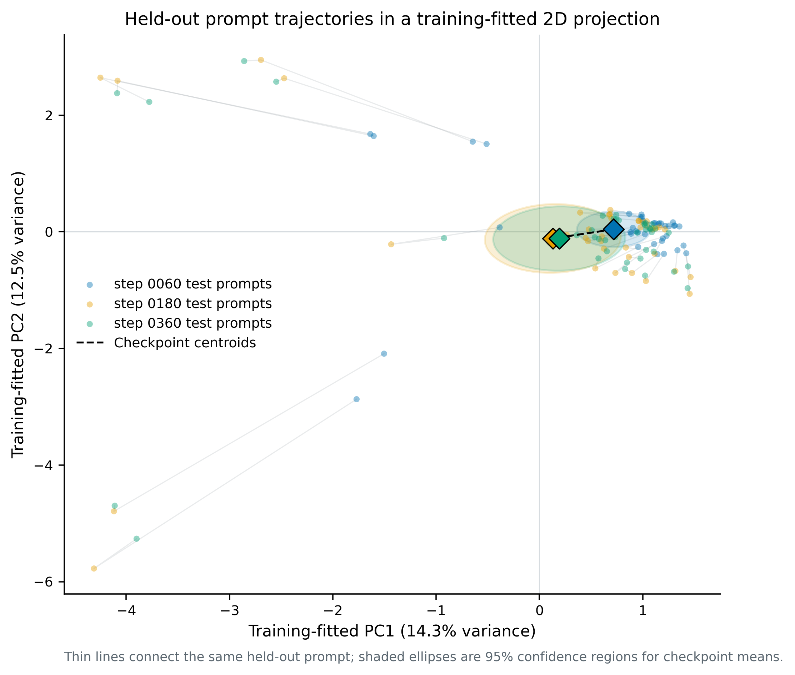

# Exhaustive OLMo 2 7B activation trajectory report

## Report status and scope

This report documents the completed OLMo 2 7B multi-checkpoint activation
trajectory smoke experiment. It covers the experimental design, immutable model
provenance, extraction integrity, registered decision rules, all
decision-relevant metrics, layer and rank dependence, checkpoint-local and
nonlinear alternatives, temporal interpolation, post hoc robustness analyses,
comparison with the earlier 1B experiment, limitations, and follow-up work.

The sealed machine-readable baseline is
`artifacts/trajectory_7b/trajectory_geometry/report_rank32.json`. The original
run output is `artifacts/trajectory_7b/trajectory_geometry/report.json` until an
explicit exploratory rerun replaces it. Activation archives and their manifests
are in `artifacts/trajectory_7b/extractions/`.

“Exhaustive” means exhaustive with respect to this experiment. Three RLVR
snapshots, one model family, one activation position, and 200 controlled prompts
do not exhaust the scientific question.

## Executive conclusion

The experiment separates two hypotheses that would otherwise be easy to
conflate:

1. **Prompt-conditional temporal interpolation is strongly supported.** For a
   held-out prompt, the raw activation chord between RLVR steps 60 and 360
   predicts step 180 with centered R2 = **0.84653**.
2. **A compact shared late-layer trajectory representation is not supported.**
   At preregistered layer 28, a global rank-32 PCA model explains only
   **0.35406** of centered held-out delta variation, far below the registered
   0.70 threshold.

Checkpoint-local rank-32 PCA improves test R2 by only **0.01186**, below the
0.05 decision threshold. A rank-32 tanh autoencoder is **0.09284 worse** than
global PCA, and its latent interpolation is **0.59158 worse** than the raw
activation chord. The registered classification is therefore:

`compact_shared_trajectory_geometry_not_supported`

The defensible baseline claim is:

> Layer-28 RLVR activations follow fairly predictable prompt-specific temporal
> paths over steps 60–360, but those paths do not compress into one shared
> rank-32-or-smaller representation across prompts.

## Research question and operational hypotheses

For prompt `p`, checkpoint `c`, and layer `l`, the analyzed vector is

`delta[p,c,l] = h[p,c,l] - h[p,DPO,l]`,

where `h` is the post-layer hidden state at the final non-padding serialized
prompt position. The embedding state is excluded.

The operational hypotheses are:

- **Shared global subspace:** one affine PCA model reconstructs pooled
  checkpoint deltas on cluster-held-out prompts.
- **Checkpoint-varying union of subspaces:** independently fitted checkpoint
  PCA models materially outperform the global model.
- **Nonlinear manifold:** a bottleneck autoencoder materially outperforms PCA
  and its latent chord materially outperforms raw activation interpolation.
- **Prompt-conditional temporal line:** endpoint interpolation predicts the
  intermediate checkpoint for the same held-out prompt.

These are activation-geometric hypotheses. This 7B trajectory run contains no
causal insertion or behavioral evaluation.

## Model and checkpoint provenance

| Role | Repository | Immutable commit | Source label | Step |
|---|---|---|---|---:|
| Reference | `allenai/OLMo-2-1124-7B-DPO` | `d6fa9c9f6f5918d0bf2a162261e0620290c9d4ed` | `refs/pr/1` safetensor conversion | — |
| RLVR | `allenai/OLMo-2-1124-7B-Instruct` | `701db8a0449554c8ada6cabc69aacc75bf68a8c3` | `step_60` | 60 |
| RLVR | `allenai/OLMo-2-1124-7B-Instruct` | `d2cc98e0a93809d41be113b2bfad45791f16969f` | `step_180` | 180 |
| RLVR | `allenai/OLMo-2-1124-7B-Instruct` | `f942bc3aae378a7ab6751bc08908262ed517a75a` | `step_360` | 360 |

The DPO safetensor commit records conversion from original revision
`e34ea60adff2e575f4fe7569eaffd1b28509b6fd`. A publication-grade replication
should explicitly verify tensor equality between the conversion and source
revision.

All manifests record repository, requested and resolved revision, artifact and
configuration hashes, tokenizer fingerprint, record-order hash, software
versions, GPU details, deterministic seed context, and whether authentication
was present. Credential values are never serialized.

## Prompt set and split

- 200 prompts in 50 semantic clusters.
- Four prompt variants per cluster.
- Categories: 60 helpfulness, 60 instruction-following, 40 honesty, 40 safety.
- Seed: 1729.
- Cluster-disjoint split: 120/40/40 prompts and 30/10/10 clusters for
  train/validation/test.
- Maximum configured serialized length: 512 tokens.

Observed serialized token counts are identical at every checkpoint:

| Statistic | Tokens |
|---|---:|
| Minimum | 18 |
| Median | 27 |
| Mean | 26.75 |
| Maximum | 41 |
| Total | 5,350 |

The test set is not category-balanced: 16 helpfulness, 12 honesty, 8
instruction-following, and 4 safety prompts. Category-level results below are
therefore explicitly post hoc.

## Activation extraction

- 32 transformer layers.
- Hidden width 4,096.
- Final serialized prompt position only.
- One activation vector after every transformer layer.
- Archive shape per checkpoint: `(200, 32, 4096)`.
- Archive dtype: float16; analysis deltas: float32.
- Sequential model loading on one 6 GB RTX 2060.
- NF4 quantization with double quantization and float16 compute.
- Safetensor loading enabled.
- Batch size one; KV cache disabled; logits not retained.

All four activation arrays are finite. Token hashes, tokenizer hashes, record
order, prompt count, layer count, hidden width, and vocabulary size match across
checkpoints. The automated test suite passes 10/10 tests.

## Split and fitting protocol

For every layer, checkpoint deltas from the 120 training prompts are pooled,
giving 360 training vectors. Validation and test sets each contain 120 pooled
vectors. PCA ranks are `[1, 2, 4, 8, 16, 32]`.

The primary layer is zero-indexed layer 28. It was selected before this run as
the relative-depth analogue of the 1B causal layer because `28/32 ~= 14/16`.
It is not itself causally validated in the 7B model.

The selected primary-layer rank is the smallest tested rank within 0.01
validation R2 of the best tested rank. Rank 32 is selected because the curve is
still increasing at the maximum tested rank.

## Reconstruction metrics

The primary registered metric is centered held-out R2 about the training mean:

`R2 = 1 - squared reconstruction error / squared deviation from train mean`.

The report also records:

- fraction of raw activation energy reconstructed;
- normalized Frobenius error, where lower is better;
- mean per-vector cosine between reconstruction and target.

Centered R2 is the decision metric because a model that merely predicts a
large checkpoint mean should not be credited with explaining prompt-level
variation.

## Registered decision rules

Rules are applied in order:

1. `nonlinear_trajectory_manifold_candidate` if autoencoder gain over global
   PCA is at least 0.05 and latent interpolation gain over the raw chord is at
   least 0.05.
2. `checkpoint_varying_union_of_subspaces_candidate` if checkpoint-local PCA
   gain over global PCA is at least 0.05.
3. `shared_global_trajectory_subspace_candidate` if global PCA held-out R2 is
   at least 0.70.
4. Otherwise `compact_shared_trajectory_geometry_not_supported`.

Observed margins are:

| Criterion | Observed | Threshold | Margin |
|---|---:|---:|---:|
| Global PCA test R2 | 0.35406 | 0.70 | -0.34594 |
| Local gain | 0.01186 | 0.05 | -0.03814 |
| Autoencoder gain | -0.09284 | 0.05 | -0.14284 |
| Latent interpolation gain | -0.59158 | 0.05 | -0.64158 |

The registered classification is not borderline.

## Primary layer rank curve

| Rank | Validation R2 | Test R2 |
|---:|---:|---:|
| 1 | 0.13743 | 0.08733 |
| 2 | 0.24047 | 0.14925 |
| 4 | 0.34664 | 0.23817 |
| 8 | 0.38426 | 0.27595 |
| 16 | 0.42876 | 0.32030 |
| 32 | 0.46460 | 0.35414 |

The rank curve remains positive and increasing at 32. The baseline supports the
claim that rank at most 32 is inadequate; it does not estimate the final
intrinsic dimensionality. Rank 32 is only 0.78% of the 4,096-dimensional width.

## Layer dependence

At rank 32, held-out R2 is:

| Layers | Pattern |
|---|---|
| 0–2 | 0.945–0.973: extremely compressible |
| 3–5 | 0.758–0.812: strongly compressible |
| 6–17 | approximately 0.72–0.78: broad middle plateau |
| 18–20 | decline from 0.673 to 0.558 |
| 21–27 | continued decline from 0.515 to 0.366 |
| 28–30 | trough near 0.352–0.354 |
| 31 | partial recovery to 0.388 |

Eighteen of 32 layers exceed the 0.70 threshold at rank 32. The negative
classification is specifically about the preregistered late layer, not a claim
that every layer lacks compact structure.

Mean checkpoint-delta norms increase sharply with depth. At layer 0 they are
approximately 0.008–0.017; at layer 28 they are 2.97–5.07; at layer 31 they are
6.54–11.42. Early-layer high R2 therefore describes small, regular changes and
does not by itself establish causal or behavioral importance.

## Global PCA and controls

At layer 28 and rank 32:

| Split/metric | Value |
|---|---:|
| Validation centered R2 | 0.46466 |
| Test centered R2 | 0.35406 |
| Test raw energy reconstructed | 0.41521 |
| Test mean cosine | 0.68646 |
| Test normalized error | 0.76472 |

Twenty orthonormalized random rank-32 Gaussian subspaces give test R2 mean
0.00786, standard deviation 0.00057, and maximum 0.00856. The fitted PCA basis
therefore captures real learned structure; it is simply not adequate as a
compact representation.

Fifty bootstrap PCA refits give mean projection similarity 0.82311 with
quantiles 0.79152 and 0.86654. The learned basis is reproducible under training
resampling despite limited held-out reconstruction.

## Checkpoint-local PCA

| Model | Test R2 | Raw energy | Cosine | Normalized error |
|---|---:|---:|---:|---:|
| Global PCA | 0.35406 | 0.41521 | 0.68646 | 0.76472 |
| Checkpoint-local PCA | 0.36592 | 0.42594 | 0.71698 | 0.75767 |

Checkpoint-local gain is 0.01186. Per checkpoint:

| Checkpoint | Global R2 | Local R2 | Gain |
|---|---:|---:|---:|
| Step 60 | 0.36996 | 0.39965 | 0.02969 |
| Step 180 | 0.33851 | 0.34404 | 0.00553 |
| Step 360 | 0.36671 | 0.37927 | 0.01256 |

Local rank-32 subspace similarities are 0.840 between steps 60 and 180, 0.835
between 180 and 360, and 0.697 between endpoints. Subspaces rotate over
training, but the rotation does not provide enough held-out reconstruction gain
to support a union-of-subspaces classification.

## Nonlinear autoencoder

The nonlinear baseline is `4096 -> 64 -> 32 -> 64 -> 4096` with tanh hidden
activations. It has 532,640 parameters. Validation early stopping selected epoch
188; training stopped after 264 epochs.

| Model | Test R2 | Raw energy | Cosine | Normalized error |
|---|---:|---:|---:|---:|
| Global PCA | 0.35406 | 0.41521 | 0.68646 | 0.76472 |
| Autoencoder | 0.26122 | 0.33115 | 0.62107 | 0.81783 |

The autoencoder is worse at every checkpoint: step-60 R2 0.19860, step-180 R2
0.26545, and step-360 R2 0.28062. This rejects the tested nonlinear baseline,
not all possible nonlinear models.

## Temporal interpolation

Step 180 lies 40% of the way from step 60 to step 360, so the raw chord is
`0.6 * delta_60 + 0.4 * delta_360`.

| Predictor | Centered R2 | Raw energy | Cosine | Normalized error |
|---|---:|---:|---:|---:|
| Raw activation chord | 0.84653 | 0.86210 | 0.96091 | 0.37135 |
| Global-PCA chord | 0.29209 | 0.36388 | 0.69441 | 0.79757 |
| Autoencoder latent chord | 0.25495 | 0.33052 | 0.63955 | 0.81822 |

Raw interpolation is the strongest positive result. Compressing endpoints to a
shared rank-32 PCA representation discards most temporally predictive
information. The autoencoder latent chord is worse still.

## Trajectory direction and non-monotonicity

At layer 28, mean delta norms are 2.9706, 5.0713, and 4.8052 for steps 60, 180,
and 360. The intermediate snapshot is farther from DPO than the final snapshot.

Mean same-prompt delta-direction cosines are:

| Pair | Cosine |
|---|---:|
| Step 60 vs 180 | 0.89396 |
| Step 180 vs 360 | 0.91847 |
| Step 60 vs 360 | 0.77992 |

The mean cosine between successive increments, 60→180 and 180→360, is -0.14868
overall and -0.20878 on test prompts. The path therefore exhibits some
overshoot or return after step 180. “Strongly interpolable” is justified;
“perfect constant-velocity straight line” is not.

## Post hoc cluster-bootstrap uncertainty

The registered report includes subspace-stability bootstrap results but not
performance intervals. A subsequent fixed-model 20,000-draw bootstrap over the
ten held-out semantic clusters gives:

| Metric | Point result | Approximate 95% interval |
|---|---:|---:|
| Global PCA R2 | 0.354 | 0.199–0.626 |
| Local PCA R2 | 0.366 | 0.207–0.649 |
| Local gain | 0.0119 | 0.0067–0.0262 |
| Raw chord R2 | 0.847 | 0.834–0.861 |

No global-PCA bootstrap draw reaches 0.70. Approximately 0.12% of local-gain
draws reach 0.05. Every raw-chord draw exceeds 0.70. These intervals are post
hoc and must not be presented as preregistered confirmatory inference.

## Post hoc category analysis

| Category | Test prompts | Global PCA test R2 |
|---|---:|---:|
| Instruction-following | 8 | 0.66020 |
| Helpfulness | 16 | 0.62291 |
| Safety | 4 | 0.43005 |
| Honesty | 12 | 0.17466 |

The category heterogeneity may contribute to the validation-to-test decline.
It is exploratory because category counts are small and the split was not
stratified.

## Comparison with the completed 1B trajectory

| Metric | 1B | 7B |
|---|---:|---:|
| Primary layer | 14/16 | 28/32 |
| Hidden width | 2,048 | 4,096 |
| Selected rank | 32 | 32 |
| Rank fraction of width | 1.56% | 0.78% |
| Global test R2 | 0.50554 | 0.35406 |
| Local gain | 0.00712 | 0.01186 |
| Autoencoder gain | -0.10495 | -0.09284 |
| Raw chord R2 | 0.95982 | 0.84653 |
| PCA chord R2 | 0.49930 | 0.29209 |
| Latent chord R2 | 0.40210 | 0.25495 |
| Bootstrap similarity | 0.84283 | 0.82311 |

The qualitative result replicates: raw prompt-conditional interpolation is much
stronger than compact shared compression, checkpoint-local gains are small, and
the tested autoencoder loses to PCA. This is not a controlled scaling law
because model releases, RLVR schedules, precision, width, and causal layer
status differ.

## Supported claims

- Matched 7B RLVR deltas contain a real and bootstrap-stable low-rank component.
- Many earlier layers are highly rank-32 compressible.
- The preregistered late layer is not adequately represented at rank 32.
- Local subspaces rotate, especially across endpoint checkpoints.
- Checkpoint-local fitting does not materially improve held-out reconstruction.
- The tested autoencoder provides no nonlinear advantage.
- Raw prompt-specific temporal interpolation is strong and robust.
- Most temporally predictive information is lost through a rank-32 bottleneck.

## Unsupported claims

The experiment does not establish a nonlinear manifold, a compact union of
local subspaces, causal steering, behavioral relevance, a universal intrinsic
dimension, exact full-precision geometry, or a model-scaling law.

## Limitations

1. Rank 32 is the maximum baseline rank and only 0.78% of hidden width.
2. NF4 quantization can introduce checkpoint-specific activation distortion.
3. Layer 28 is a relative-depth analogue, not a causally validated 7B site.
4. Only the final prompt position is analyzed.
5. The test set contains only ten clusters and is category-imbalanced.
6. Only three RLVR snapshots define one interpolation triple.
7. DPO is a common reference, not a uniformly spaced RLVR time-zero state.
8. One small autoencoder cannot exhaust nonlinear alternatives.
9. The report is explicitly exploratory multi-checkpoint smoke evidence.
10. Runtime provenance records a dirty worktree; publication runs should seal a
    commit.

## Baseline conclusion

The best current geometric description is a collection of fairly smooth,
prompt-conditioned trajectories occupying a substantially higher-dimensional
late-layer region. It is not one compact rank-32 alignment manifold.

## Follow-up 1: extended-rank result

An exploratory extension reused the verified matched activations and added PCA
ranks 64, 128, 256, and 359. Rank 359 is the maximum estimable rank from 360
pooled training vectors after mean subtraction.

| Rank | Validation R2 | Test R2 |
|---:|---:|---:|
| 32 | 0.46460 | 0.35414 |
| 64 | 0.49608 | 0.38150 |
| 128 | 0.52506 | 0.41491 |
| 256 | 0.55347 | 0.44971 |
| 359 | 0.57255 | 0.47049 |

The validation rule selects rank 359 because performance is still rising at the
maximum. Nevertheless, test R2 remains 0.22951 below the 0.70 compactness
threshold. Increasing rank more than eleven-fold over the baseline recovers
only 0.11635 additional test R2.

At rank 359, random-subspace mean R2 rises to 0.08737 because the random basis
now spans 8.8% of the ambient width. Learned PCA still substantially exceeds
that control. Bootstrap projection similarity declines from 0.823 at rank 32 to
0.646 at rank 359, showing that the added high-rank directions are much less
stable.

Checkpoint-local PCA is not capacity-matched in this extension: each checkpoint
has only 120 training vectors, so a centered local PCA fit has effective rank at
most 119 while global PCA reaches 359. Its reported negative gain (-0.06349)
must not be interpreted as evidence that shared geometry is intrinsically
better. The extended-rank run is decision-relevant for global compactness, not a
fair high-rank local/global comparison.

The autoencoder also remains constrained by its 64-unit hidden layers even when
its nominal latent size is 359. Its extended-rank result is therefore not a fair
359-dimensional nonlinear-capacity comparison.

The exploratory machine report is
`artifacts/trajectory_7b/trajectory_geometry/report_extended_rank.json`; figures
are in `reports/figures_7b_extended/`. The registered rank-32 report remains the
primary baseline.

## Follow-ups 4, 5, and 8: stratified split robustness

A category-stratified, cluster-disjoint 60/20/20 splitter was evaluated over 20
deterministic seeds at layer 28 and rank 32. Every split contains the intended
category proportions at the cluster level.

| Metric across seeds | Mean | SD | Minimum | Maximum |
|---|---:|---:|---:|---:|
| Global PCA test R2 | 0.44305 | 0.04683 | 0.35362 | 0.55359 |
| Raw chord test R2 | 0.85774 | 0.00483 | 0.84465 | 0.86344 |

No split reaches the 0.70 shared-subspace threshold. The negative compactness
decision is therefore not an accident of the original unstratified split. Raw
interpolation is exceptionally stable across split seeds.

Category-specific test R2 across the same 20 splits is:

| Category | Mean | SD | Minimum | Maximum |
|---|---:|---:|---:|---:|
| Helpfulness | 0.58063 | 0.03640 | 0.52339 | 0.63355 |
| Honesty | 0.19780 | 0.03601 | 0.12420 | 0.26046 |
| Instruction-following | 0.62874 | 0.02803 | 0.58558 | 0.67941 |
| Safety | 0.42644 | 0.06811 | 0.23596 | 0.48404 |

Honesty is consistently the least rank-32-compressible category, while
instruction-following is the most compressible. A 20,000-draw cluster bootstrap
for the stratified seed-1729 split gives global test R2 interval 0.29660–0.61410.

The machine-readable robustness output is
`artifacts/trajectory_7b/robustness/report.json`. This follow-up registers the
analysis code and establishes split robustness on the existing 200 prompts; the
separate prompt-expansion component of follow-up 4 still requires new model
extractions.

## Follow-up 2: NF4 versus true FP16 calibration

Twenty matched prompts spanning all four categories were extracted from DPO and
RLVR step 180 in true FP16. Because the 7B model cannot fit in 6 GiB VRAM, the
model was dispatched across 4.5 GiB of GPU capacity and CPU RAM. The identical
prompts were matched to the baseline NF4 archives by immutable example ID.

At layer 28:

| Quantity | DPO activation | Step-180 activation | Step-180 minus DPO delta |
|---|---:|---:|---:|
| Mean NF4/FP16 cosine | 0.98090 | 0.98038 | 0.90560 |
| Mean relative error | 0.19225 | 0.19438 | 0.44307 |
| Mean NF4/FP16 norm ratio | 0.98380 | 0.98576 | 1.04269 |
| NF4 predicting FP16 R2 | 0.94374 | 0.94328 | 0.80172 |

NF4 preserves the large absolute activation vectors reasonably well, but
checkpoint differencing amplifies independent quantization errors. The layer-28
delta remains directionally similar and retains about 0.80 R2 relative to FP16,
yet a 44% mean relative delta error is not negligible.

Across layers, mean checkpoint-delta cosine is 0.894. Early-layer delta R2 can
be strongly negative because the true checkpoint deltas are tiny relative to
quantization error, whereas the best layer-wise delta R2 is approximately 0.83.
The baseline NF4 trajectory should therefore be interpreted as a useful but
noisy approximation, not an exact full-precision measurement.

The calibration artifacts and machine-readable analysis are in
`artifacts/trajectory_7b_fp16_calibration/`. A larger FP16 prompt sample would
improve precision, but this run is sufficient to demonstrate the direction and
scale of the NF4 distortion.

## Follow-up protocol

The next registered work expands ranks to 64, 128, 256, and the maximum
estimable pooled-training rank; calibrates NF4 against a higher-precision
condition; adds 7B causal controls; expands and stratifies prompts; repeats split
seeds with cluster bootstrap; adds checkpoints and interpolation triples; tests
stronger nonlinear baselines; registers category analyses; evaluates generated
tokens and multiple positions; and regenerates final figures from generic,
model-aware plotting code.
