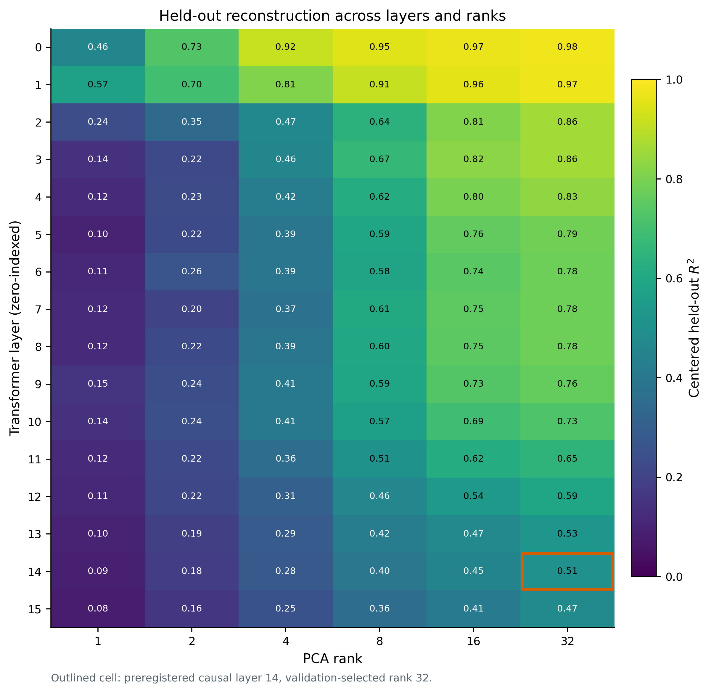
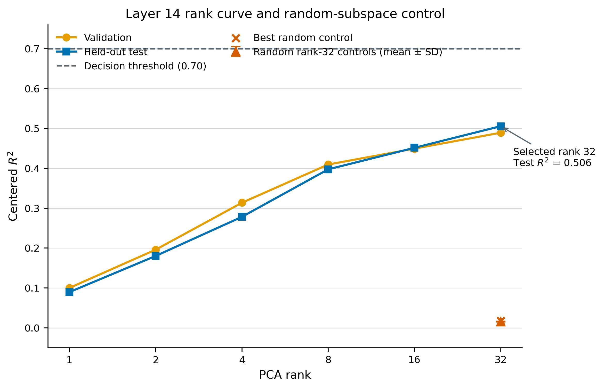
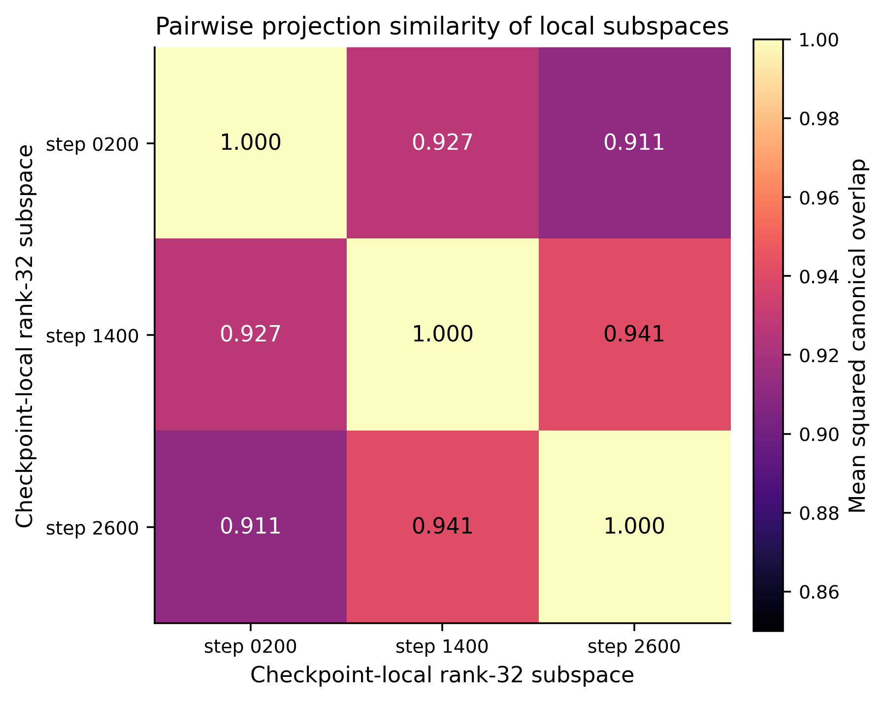
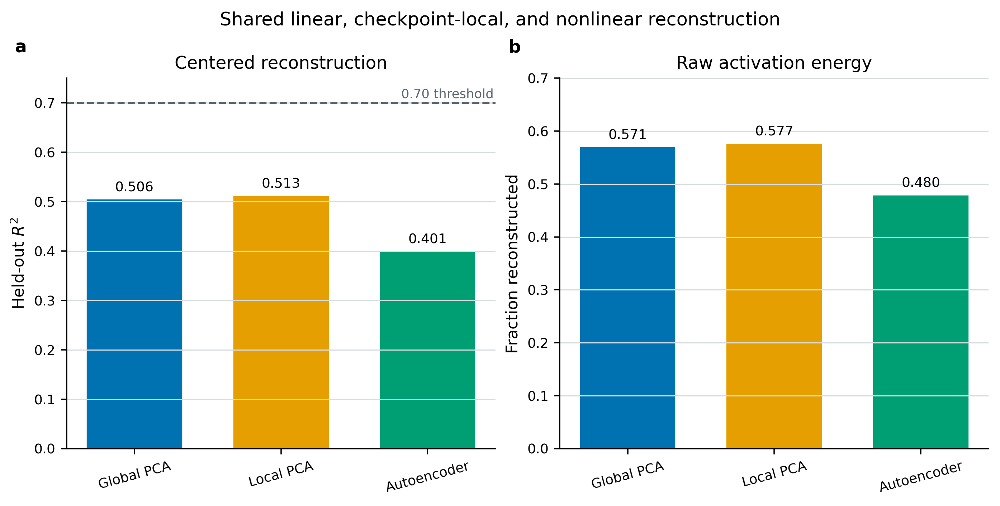
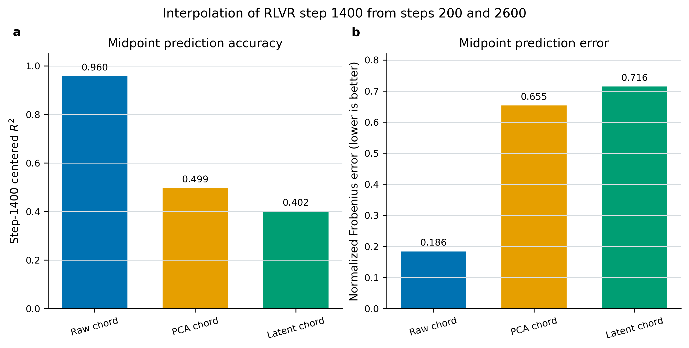
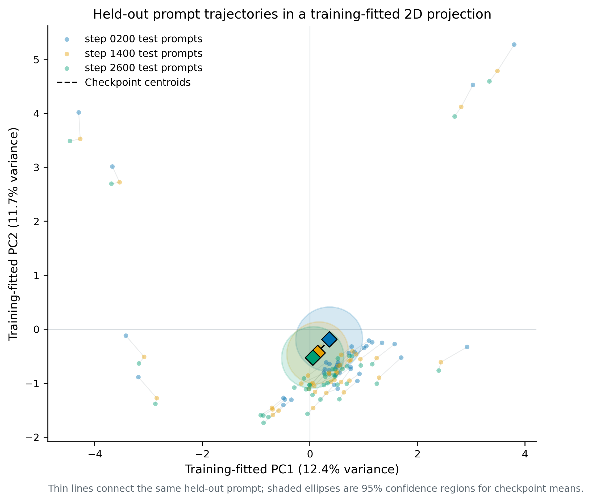

# Exhaustive multi-checkpoint activation trajectory report

## Report status and scope

This is the exhaustive human-readable report for the current OLMo 2 1B
multi-checkpoint smoke protocol. It documents every analysis family and every
decision-relevant summary statistic, the full layer-by-rank validation and test
R2 matrices, checkpoint provenance, extraction integrity, decision thresholds,
limitations, and reproducibility instructions. Every raw metric field, including
the four reconstruction metrics for all 96 layer/rank rows, remains preserved in
the sealed machine-readable output at
`artifacts/trajectory/trajectory_geometry/report.json`.

“Exhaustive” here means exhaustive with respect to this experiment. It does not
mean that three checkpoints, one model family, one activation site, and 200
controlled prompts exhaust the scientific question.

## Executive conclusion

The experiment ran end to end on one NVIDIA GeForce RTX 2060 with 6 GB VRAM.
The result separates two hypotheses that would be easy to conflate:

1. **Prompt-conditional temporal linearity is strongly supported.** For each
   held-out prompt, the uncompressed activation midpoint between RLVR steps 200
   and 2600 predicts step 1400 with centered R2 = **0.960**.
2. **A compact shared trajectory manifold across prompts is not supported.** At
   the preregistered causal layer, a global rank-32 PCA model explains only
   **0.506** of centered held-out delta variance, below the prespecified 0.70
   threshold. The rank curve is still rising at 32.

Checkpoint-local PCA improves global PCA by only **0.007**, and a rank-32
autoencoder performs **0.105 worse** than global PCA. Thus, this run contains no
positive evidence for a rotating union of local subspaces or for a curved
nonlinear manifold. The registered machine classification is
`compact_shared_trajectory_geometry_not_supported`.

The defensible claim is:

> RLVR checkpoint activations follow a nearly straight prompt-conditional path
> over steps 200-2600, but the family of paths does not compress into one shared
> rank-32-or-smaller representation at layer 14.

## Research questions and operational hypotheses

The experiment asks whether matched post-training activation changes can be
described by compact shared geometry.

For prompt `p`, checkpoint `c`, and layer `l`, the analyzed vector is

`delta[p,c,l] = h[p,c,l] - h[p,DPO,l]`,

where `h` is the final serialized prompt-position residual-stream activation.
All vectors have width 2,048.

The operational hypotheses are:

- **Shared global subspace:** a single low-rank affine PCA model reconstructs
  pooled checkpoint deltas on cluster-held-out prompts.
- **Checkpoint-varying local subspaces:** separately fitted checkpoint PCA models
  materially outperform the shared global PCA model.
- **Nonlinear trajectory manifold:** a bottleneck autoencoder materially
  outperforms global PCA and its latent interpolation materially outperforms the
  raw activation chord.
- **Prompt-conditional temporal line:** for the same prompt, linear interpolation
  in activation space predicts the middle checkpoint from the two endpoints.

These are activation-geometric statements. Except for the separate endpoint
smoke experiment, they are not yet causal or behavioral claims.

## Model and checkpoint provenance

All checkpoints share the OLMo 2 1B architecture. The repository configuration
now pins immutable commits; source aliases are retained for readability.

| Role | Repository and source revision | Resolved immutable commit | Training step |
|---|---|---|---:|
| Reference | `allenai/OLMo-2-0425-1B-DPO@main` | `c4b0485961ab24c2433b090f3b922f0913a9290f` | - |
| RLVR snapshot | `allenai/OLMo-2-0425-1B-Instruct@step_200` | `0f49bb9c8bb23d43b51b1732be137a99bfaaf9ec` | 200 |
| RLVR snapshot | `allenai/OLMo-2-0425-1B-Instruct@step_1400` | `f354d6c946069e94c330df51b754903a4ad77fbe` | 1400 |
| RLVR snapshot | `allenai/OLMo-2-0425-1B-Instruct@step_2600` | `a7b49f0c28561ccc212976a6b036ee556ee61fd7` | 2600 |

The trajectory analyzes each RLVR snapshot relative to DPO. It does not treat
DPO as an additional point on a uniformly spaced RLVR training-time axis.

## Data and activation extraction

### Prompt set

- 200 deterministic prompts in 50 semantic clusters.
- Four variants per cluster.
- Categories: 60 helpfulness, 60 instruction-following, 40 honesty, and 40
  safety prompts.
- Cluster-disjoint split: 30/10/10 clusters and 120/40/40 prompts for
  train/validation/test.
- The split seed is 1729.
- Maximum serialized length is 512 tokens; no observed prompt approaches this
  limit.

Observed serialized token counts are:

| Statistic | Tokens |
|---|---:|
| Minimum | 18 |
| Median | 27 |
| Mean | 26.75 |
| Maximum | 41 |
| Total across 200 records | 5,350 |

### Activation site and serialization

Each prompt is serialized with the checkpoint tokenizer's chat template as one
user message with `add_generation_prompt=True`. The model is run without KV
cache and with hidden states enabled. For each of 16 transformer layers, the
activation after that layer at the final non-padding serialized prompt position
is stored. Embedding-layer state is excluded. Logits are not retained for the
trajectory run.

The resulting array per checkpoint has shape `(200, 16, 2048)` and dtype
float16. Analysis converts deltas to float32. Checkpoints are loaded sequentially
in FP16, never concurrently.

### Matching and artifact integrity

Exact equality was verified for example IDs, cluster IDs, token hashes, token
lengths, flattened token IDs, and token offsets across all four checkpoints.
Every artifact contains the same 5,350-token stream in the same record order.

| Artifact | Size (MiB) | SHA-256 | Cache policy |
|---|---:|---|---|
| `dpo.npz` | 12.64 | `7f3a83d0b37c4b108dcd5eeaff809986f7fc8ac89ab18e6d650085b1bb1f4650` | Persistent shared cache |
| `rlvr_0200.npz` | 12.64 | `fe52a07743f785e2556318b17badbfeb7b19d170d7cde314f6a130406550a86f` | Ephemeral checkpoint cache |
| `rlvr_1400.npz` | 12.64 | `de4e7a9700dfd2f7dd96bcbaa35d15445330dcf3224ff2b2dd8c2b6a2f9d8fbb` | Ephemeral checkpoint cache |
| `rlvr_2600.npz` | 12.64 | `732d327eaf3eb6528867986733323729de032d89cff4e36f2d53246d40873f9e` | Ephemeral checkpoint cache |

Each RLVR cache was deleted only after the activation archive and checksum
manifest were durably written. The ephemeral cache root was empty after the run.
The four retained archives total approximately 50.55 MiB.

## Analysis design

### Split discipline

All rank selection and model fitting use cluster-disjoint data:

- Global PCA training pool: 3 checkpoints x 120 training prompts = 360 rows.
- Global PCA validation pool: 3 x 40 = 120 rows.
- Global PCA test pool: 3 x 40 = 120 rows.
- Checkpoint-local PCA: 120 training prompts per checkpoint.
- Autoencoder: the same 360 pooled training rows, with 120 pooled validation
  rows for early stopping.

The primary layer is fixed to layer 14 (zero-indexed) from the earlier endpoint
causal screen. It is not selected using trajectory test performance. Candidate
ranks are 1, 2, 4, 8, 16, and 32. At layer 14, rank is chosen as the smallest
candidate within 0.01 validation R2 of the maximum candidate; rank 32 is selected.

### Global PCA

For each layer and rank, PCA is fitted after subtracting the pooled training
mean. The fitted affine reconstruction is applied unchanged to validation and
test rows. The primary confirmatory comparison uses layer 14.

### Random-subspace control

At selected rank 32, 20 random Gaussian bases are orthonormalized and evaluated
around the same pooled training mean. This tests whether reconstruction follows
merely from allocating 32 dimensions rather than learning data-aligned geometry.

### Stability and checkpoint-local geometry

Global subspace stability is estimated from 50 bootstrap fits. The reported
similarity is mean squared projection overlap. Separately, a rank-32 PCA model is
fitted to each checkpoint's training prompts. Local reconstruction is pooled on
held-out prompts, and pairwise local-basis similarity is computed as mean squared
canonical overlap.

The current bootstrap resamples pooled rows, not semantic clusters. Its interval
is therefore exploratory and potentially too narrow.

### Nonlinear baseline

The autoencoder architecture is `2048 -> 64 -> 32 -> 64 -> 2048`, with tanh
nonlinearities. It has 268,448 parameters and is trained with AdamW at learning
rate 0.001 and weight decay 0.0001. Inputs are centered by the pooled training
mean and divided by a scalar training RMS. Maximum training is 1,000 epochs with
75-epoch early stopping. The retained fit stopped after 215 epochs; its best
validation point was epoch 139 with normalized MSE 0.583475.

This is a controlled nonlinear baseline, not an exhaustive search over manifold
learners or autoencoder capacity.

### Interpolation test

Step 1400 is exactly halfway between steps 200 and 2600:

`weight = (1400 - 200) / (2600 - 200) = 0.5`.

For each held-out prompt, three predictions of its step-1400 delta are compared:

- raw chord: `0.5 * delta_0200 + 0.5 * delta_2600`;
- global-PCA chord: the same chord after endpoint reconstruction by global PCA;
- latent chord: linear interpolation of endpoint autoencoder codes, decoded back
  into activation space.

### Metrics

For values `X`, predictions `Xhat`, and the relevant training mean `mu`:

- **Centered R2:** `1 - ||X-Xhat||^2 / ||X-mu||^2`. This is the primary metric.
- **Fraction raw energy reconstructed:** `1 - ||X-Xhat||^2 / ||X||^2`.
- **Normalized Frobenius error:** `sqrt(||X-Xhat||^2 / ||X||^2)`; lower is better.
- **Mean reconstruction cosine:** row-wise cosine similarity averaged over rows.

Centered R2 prevents the large affine mean from being mistaken for low-rank
explanatory power. Raw-energy reconstruction is reported as a complementary
scale-dependent diagnostic.

### Prespecified decision taxonomy

The code evaluates outcomes in this order:

1. `nonlinear_trajectory_manifold_candidate` if autoencoder gain over global PCA
   is at least 0.05 **and** latent interpolation gain over the raw chord is at
   least 0.05.
2. `checkpoint_varying_union_of_subspaces_candidate` if checkpoint-local PCA
   gain over global PCA is at least 0.05.
3. `shared_global_trajectory_subspace_candidate` if global PCA test R2 is at
   least 0.70.
4. Otherwise, `compact_shared_trajectory_geometry_not_supported`.

The status is explicitly `exploratory_multi_checkpoint_smoke`, not confirmatory
evidence across models or datasets.

## Results

### 1. All-layer rank structure



**Figure 1. Held-out centered R2 for every tested transformer layer and PCA
rank.** PCA is fitted on pooled training prompts and evaluated on cluster-held-out
test prompts. The orange outline marks the preregistered causal layer 14 and
validation-selected rank 32. Early layers are substantially more compressible,
but they were not selected by the endpoint causal screen. Values and colors use
a fixed 0-1 scale. [Vector PDF](figures_1b/fig01_layer_rank_heatmap.pdf)

The layer comparison reveals a strong depth trend. Rank-32 held-out R2 falls from
0.980 at layer 0 and 0.975 at layer 1 to 0.506 at layer 14 and 0.473 at layer 15.
Thus, “the trajectory is compact” would depend critically on activation site.
The primary conclusion remains tied to layer 14 because that layer was fixed by
the prior causal endpoint protocol.

### 2. Primary-layer rank curve and controls



**Figure 2. Layer-14 validation and held-out rank curves with rank-32 random
controls.** The dashed horizontal line is the 0.70 shared-subspace threshold.
The random marker reports mean +/- one standard deviation across 20 controls;
the cross is the best control. Rank was selected using validation, not test,
performance. [Vector PDF](figures_1b/fig02_primary_layer_rank_curve.pdf)

| Rank | Validation centered R2 | Test centered R2 |
|---:|---:|---:|
| 1 | 0.100 | 0.090 |
| 2 | 0.196 | 0.180 |
| 4 | 0.314 | 0.279 |
| 8 | 0.410 | 0.398 |
| 16 | 0.449 | 0.452 |
| 32 | 0.489 | 0.506 |

The curve has not saturated by rank 32. The learned rank-32 result is far above
random controls (mean 0.01563, SD 0.00112, maximum 0.01738), demonstrating real
shared structure, but not compact structure under the experiment's 0.70 rule.

Global rank-32 bootstrap projection similarity is 0.84283, with exploratory
2.5th and 97.5th percentiles 0.80772 and 0.88979.

### 3. Checkpoint-local subspace alignment



**Figure 3. Pairwise mean squared canonical overlap between checkpoint-local
rank-32 PCA bases.** Each basis is fitted only on that checkpoint's training
prompts. The diagonal is one by construction, up to floating-point error.
[Vector PDF](figures_1b/fig03_subspace_similarity.pdf)

| Local basis pair | Projection similarity |
|---|---:|
| Step 0200 vs 1400 | 0.9272 |
| Step 0200 vs 2600 | 0.9110 |
| Step 1400 vs 2600 | 0.9413 |

The local spaces are highly aligned. Combined with the negligible local
reconstruction gain, this argues against a sharply rotating tangent-space story.

### 4. Global, local, and nonlinear reconstruction



**Figure 4. Held-out reconstruction by global PCA, checkpoint-local PCA, and the
rank-32 autoencoder.** Panel a shows the primary centered R2 and the 0.70 decision
threshold. Panel b shows fraction of raw activation energy reconstructed. Both
panels use zero baselines and print exact rounded values. [Vector
PDF](figures_1b/fig04_model_comparison.pdf)

| Model | Centered R2 | Raw energy fraction | Normalized error | Mean cosine | Gain over global |
|---|---:|---:|---:|---:|---:|
| Global rank-32 PCA | 0.50554 | 0.57090 | 0.65506 | 0.74019 | - |
| Checkpoint-local rank-32 PCA | 0.51266 | 0.57708 | 0.65032 | 0.74713 | +0.00712 |
| Rank-32 autoencoder | 0.40060 | 0.47983 | 0.72123 | 0.67457 | -0.10495 |

The local gain is seven times smaller than the 0.05 threshold. The autoencoder
is worse than global PCA on every reported reconstruction metric. This is
evidence against the tested nonlinear baseline, not proof that all nonlinear
representations must fail.

Global PCA validation metrics are centered R2 0.48938, raw-energy fraction
0.55716, normalized error 0.66546, and mean cosine 0.72456. Their proximity to
test metrics does not suggest a validation/test collapse.

### 5. Midpoint interpolation



**Figure 5. Prediction of step-1400 held-out activations from steps 200 and
2600.** Panel a shows centered R2; panel b shows normalized Frobenius error, where
lower is better. Predictions are paired by exact prompt and token stream.
[Vector PDF](figures_1b/fig05_interpolation_comparison.pdf)

| Interpolator | Centered R2 | Raw energy fraction | Normalized error | Mean cosine |
|---|---:|---:|---:|---:|
| Raw activation chord | 0.95982 | 0.96553 | 0.18566 | 0.97788 |
| Global-PCA chord | 0.49930 | 0.57048 | 0.65538 | 0.73645 |
| Autoencoder latent chord | 0.40210 | 0.48709 | 0.71618 | 0.67950 |

The raw chord is the experiment's strongest result. Global rank-32 compression
discards approximately half the centered midpoint variation needed for accurate
prediction. Latent interpolation is 0.55772 R2 worse than the raw chord, opposite
the direction required for a nonlinear-manifold candidate.

### 6. Descriptive held-out trajectory projection



**Figure 6. Forty held-out prompt trajectories projected into two PCs fitted
only on the pooled training prompts.** Thin lines connect the same prompt at
steps 200, 1400, and 2600. Diamonds are checkpoint centroids; shaded ellipses are
normal-theory 95% confidence regions for each centroid. PC1 and PC2 explain
12.4% and 11.7% of pooled training variance. The projection is descriptive: its
24.1% total variance capture is insufficient for judging the high-dimensional
interpolation result. [Vector PDF](figures_1b/fig06_test_prompt_trajectory.pdf)

The plot makes two qualitative facts visible without replacing the quantitative
tests: prompt identity contributes substantial dispersion and outliers, while
checkpoint centroids move along a comparatively short path. High-dimensional
raw-chord R2, not apparent straightness in this projection, supports temporal
linearity.

## Per-checkpoint held-out results

The global PCA result is consistent across snapshots rather than being caused by
one poor checkpoint.

| Checkpoint | Model | Centered R2 | Raw energy fraction | Normalized error | Mean cosine |
|---|---|---:|---:|---:|---:|
| Step 0200 | Global PCA | 0.50597 | 0.56817 | 0.65714 | 0.73791 |
| Step 0200 | Local PCA | 0.52114 | 0.58143 | 0.64697 | 0.74955 |
| Step 0200 | Autoencoder | 0.39893 | 0.47461 | 0.72484 | 0.66746 |
| Step 1400 | Global PCA | 0.51062 | 0.57766 | 0.64988 | 0.74157 |
| Step 1400 | Local PCA | 0.51060 | 0.57764 | 0.64989 | 0.74468 |
| Step 1400 | Autoencoder | 0.40818 | 0.48925 | 0.71467 | 0.67913 |
| Step 2600 | Global PCA | 0.50057 | 0.56753 | 0.65763 | 0.74109 |
| Step 2600 | Local PCA | 0.50604 | 0.57227 | 0.65401 | 0.74715 |
| Step 2600 | Autoencoder | 0.39547 | 0.47653 | 0.72351 | 0.67711 |

## Decision audit

| Candidate conclusion | Required evidence | Observed evidence | Outcome |
|---|---|---|---|
| Nonlinear manifold | AE gain >= 0.05 and latent-chord gain >= 0.05 | -0.10495 and -0.55772 | Rejected |
| Checkpoint-varying union | Local PCA gain >= 0.05 | +0.00712 | Rejected |
| Shared compact subspace | Global test R2 >= 0.70 | 0.50554 | Rejected |
| Prompt-conditional line | Raw chord accurately predicts midpoint | R2 0.95982 | Strongly supported within sampled interval |

The first three rules determine the registered classification. The fourth is a
scientific interpretation of the separately reported interpolation diagnostic;
it does not override failure of shared compactness.

## Relationship to the endpoint causal smoke test

The earlier SFT-to-DPO/DPO-to-SFT test found that low-rank directions at layer 14
can causally recover a substantial fraction of endpoint logit change. That result
motivated fixing layer 14 here. The trajectory experiment does **not** load each
intermediate model as a causal donor into DPO and therefore does not establish
that the raw midpoint chord is functionally sufficient. Geometry and causality
must remain separate until that intervention is run.

See [`SMOKE_RESULTS.md`](SMOKE_RESULTS.md) for the endpoint causal protocol.

## Hardware, software, and feasibility

| Component | Recorded value |
|---|---|
| GPU | NVIDIA GeForce RTX 2060 |
| VRAM | 6,442,123,264 bytes (~6.0 GiB) |
| Compute capability | 7.5 |
| CUDA runtime | 12.4 |
| Python | 3.10.11 |
| PyTorch | 2.6.0+cu124 |
| Transformers | 5.3.0 |
| Hugging Face Hub | 1.4.1 |
| NumPy | 2.2.6 |
| scikit-learn | 1.7.2 |
| Platform | Windows 10 build 26200 |

Once weights were available locally, observed extraction runtimes ranged from
approximately 13 to 28 seconds for 200 prompts. The step-200 and step-1400
manifest durations include slow network transfer and are therefore 750 and 834
seconds; they are not GPU throughput measurements. The final geometry command
took approximately 15 seconds wall clock, while its internal analysis timer
reported 5.8 seconds. Network transfer, not 6 GB VRAM, was the practical
bottleneck.

Hugging Face Xet downloads repeatedly stalled on this connection. Resuming with
`HF_HUB_DISABLE_XET=1` finalized the existing partial checkpoint immediately.
The README now documents this standard HTTP fallback.

## Threats to validity

### Internal validity

- The prompt split is group-disjoint, but model selection still uses one fixed
  seed and one validation partition.
- Rank 32 is the largest candidate. The continued upward curve means the run
  cannot locate the rank required to reach 0.70, only show that it exceeds 32 at
  layer 14 under this sample.
- PCA and autoencoder capacity are matched by latent width, not by parameter
  count or effective regularization.
- Bootstrap stability resamples rows rather than semantic clusters.
- Float16 extraction introduces quantization before float32 analysis, although
  all checkpoints use the same regime.

### Construct validity

- “Manifold” is operationalized through reconstruction and interpolation; these
  do not measure semantic behavior directly.
- Only the final serialized prompt position is observed. Token-wise or sequence-
  level geometry may differ.
- DPO-relative deltas mix prompt-specific offsets, checkpoint means, and
  checkpoint-by-prompt interactions. This is appropriate for testing the strong
  shared-subspace claim but may obscure a much lower-rank temporal component.
- The nonlinear baseline is one small tanh autoencoder. Its failure does not
  exhaust nonlinear geometry.
- A visually curved or straight 2D projection can be misleading because Figure
  6 captures only 24.1% of training variance.

### External validity

- There are only three RLVR snapshots, yielding one midpoint and no independent
  checkpoint-level test case.
- All checkpoints come from one 1B model family and one training trajectory.
- The controlled 200-prompt set is balanced for diagnostic categories but is not
  a representative deployment or benchmark distribution.
- No independent seed, model size, post-training method, or architecture is
  included.

### Causal validity

- The midpoint predictions have not been inserted into the DPO model.
- High activation-space R2 need not imply logit, generation, reward, or behavior
  recovery.
- Layer 14 was causally useful for an endpoint contrast; that does not guarantee
  it is the only or best causal site for intermediate RLVR motion.

## Recommended next protocol

The next experiment should target temporal structure directly rather than merely
increase autoencoder capacity.

1. Extract five to seven evenly spaced RLVR checkpoints with the same sequential
   cache cleanup.
2. Decompose each delta into prompt mean, checkpoint mean, and interaction
   residual. Report low-rank structure for each component separately.
3. Fit a low-rank tensor model or functional PCA over prompt x checkpoint x
   hidden dimensions.
4. Hold out entire checkpoints. Predict them from neighboring steps using raw
   chords, temporal PCA, splines, tensor factors, and nonlinear latent paths.
5. Add cluster-level bootstrap intervals for reconstruction and interpolation.
6. Insert predicted checkpoint deltas into DPO at layer 14 and measure logit
   recovery, followed by controlled generation/reward metrics.
7. Repeat the frozen protocol on a larger behavioral prompt set and at least one
   independent model trajectory.

The highest-priority causal test is direct midpoint insertion: add the predicted
step-1400 raw chord to DPO and compare its logits against the actual step-1400
model. If the 0.960 geometric result survives that intervention, the temporal
line would be functionally meaningful.

## Reproducibility

Install the package and visualization dependency:

```powershell
python -m pip install -e ".[dev,viz]"
```

Extract immutable checkpoints sequentially:

```powershell
$env:HF_TOKEN = Read-Host -MaskInput "Hugging Face token"
$env:HF_HUB_DISABLE_XET = "1"
alignment-manifold extract --config configs/trajectory.yaml --checkpoint dpo
alignment-manifold extract --config configs/trajectory.yaml --checkpoint rlvr_0200
alignment-manifold extract --config configs/trajectory.yaml --checkpoint rlvr_1400
alignment-manifold extract --config configs/trajectory.yaml --checkpoint rlvr_2600
Remove-Item Env:HF_TOKEN
Remove-Item Env:HF_HUB_DISABLE_XET
```

Run geometry and regenerate all six figures:

```powershell
alignment-manifold trajectory --config configs/trajectory.yaml --force
python scripts/generate_trajectory_figures.py
python -m pytest
```

Each figure is emitted as a 320-DPI PNG and a vector PDF. The plotting script
fits Figure 6's PCA only on training prompts and reads all other values directly
from the sealed report.

## Appendix A: full held-out layer-by-rank centered R2

| Layer | Rank 1 | Rank 2 | Rank 4 | Rank 8 | Rank 16 | Rank 32 |
|---:|---:|---:|---:|---:|---:|---:|
| 0 | 0.459 | 0.728 | 0.917 | 0.953 | 0.972 | 0.980 |
| 1 | 0.572 | 0.695 | 0.811 | 0.910 | 0.960 | 0.975 |
| 2 | 0.237 | 0.347 | 0.469 | 0.643 | 0.809 | 0.860 |
| 3 | 0.141 | 0.223 | 0.461 | 0.666 | 0.824 | 0.860 |
| 4 | 0.118 | 0.229 | 0.418 | 0.619 | 0.799 | 0.832 |
| 5 | 0.100 | 0.224 | 0.394 | 0.590 | 0.759 | 0.787 |
| 6 | 0.112 | 0.265 | 0.391 | 0.585 | 0.745 | 0.779 |
| 7 | 0.119 | 0.204 | 0.372 | 0.606 | 0.750 | 0.780 |
| 8 | 0.124 | 0.224 | 0.391 | 0.600 | 0.747 | 0.779 |
| 9 | 0.154 | 0.239 | 0.405 | 0.589 | 0.732 | 0.764 |
| 10 | 0.142 | 0.243 | 0.405 | 0.565 | 0.692 | 0.726 |
| 11 | 0.123 | 0.222 | 0.356 | 0.509 | 0.618 | 0.652 |
| 12 | 0.114 | 0.217 | 0.309 | 0.462 | 0.535 | 0.588 |
| 13 | 0.100 | 0.189 | 0.285 | 0.424 | 0.469 | 0.527 |
| **14** | **0.090** | **0.180** | **0.278** | **0.398** | **0.452** | **0.506** |
| 15 | 0.079 | 0.159 | 0.252 | 0.356 | 0.411 | 0.473 |

## Appendix B: full validation layer-by-rank centered R2

| Layer | Rank 1 | Rank 2 | Rank 4 | Rank 8 | Rank 16 | Rank 32 |
|---:|---:|---:|---:|---:|---:|---:|
| 0 | 0.463 | 0.710 | 0.908 | 0.949 | 0.970 | 0.978 |
| 1 | 0.548 | 0.671 | 0.778 | 0.890 | 0.949 | 0.966 |
| 2 | 0.177 | 0.353 | 0.499 | 0.659 | 0.804 | 0.857 |
| 3 | 0.195 | 0.318 | 0.519 | 0.694 | 0.843 | 0.872 |
| 4 | 0.158 | 0.273 | 0.456 | 0.630 | 0.806 | 0.839 |
| 5 | 0.142 | 0.259 | 0.419 | 0.611 | 0.773 | 0.804 |
| 6 | 0.156 | 0.271 | 0.415 | 0.613 | 0.760 | 0.791 |
| 7 | 0.155 | 0.248 | 0.421 | 0.616 | 0.766 | 0.790 |
| 8 | 0.155 | 0.263 | 0.428 | 0.592 | 0.738 | 0.768 |
| 9 | 0.187 | 0.283 | 0.441 | 0.584 | 0.718 | 0.752 |
| 10 | 0.159 | 0.276 | 0.419 | 0.563 | 0.663 | 0.702 |
| 11 | 0.136 | 0.249 | 0.373 | 0.510 | 0.587 | 0.623 |
| 12 | 0.124 | 0.237 | 0.351 | 0.471 | 0.528 | 0.574 |
| 13 | 0.107 | 0.207 | 0.330 | 0.431 | 0.474 | 0.517 |
| **14** | **0.100** | **0.196** | **0.314** | **0.410** | **0.449** | **0.489** |
| 15 | 0.092 | 0.178 | 0.300 | 0.384 | 0.425 | 0.469 |

## Appendix C: generated figure inventory

| Figure | PNG | Vector PDF |
|---|---|---|
| Layer/rank heatmap | [`fig01_layer_rank_heatmap.png`](figures_1b/fig01_layer_rank_heatmap.png) | [`fig01_layer_rank_heatmap.pdf`](figures_1b/fig01_layer_rank_heatmap.pdf) |
| Primary-layer rank curve | [`fig02_primary_layer_rank_curve.png`](figures_1b/fig02_primary_layer_rank_curve.png) | [`fig02_primary_layer_rank_curve.pdf`](figures_1b/fig02_primary_layer_rank_curve.pdf) |
| Local-subspace similarity | [`fig03_subspace_similarity.png`](figures_1b/fig03_subspace_similarity.png) | [`fig03_subspace_similarity.pdf`](figures_1b/fig03_subspace_similarity.pdf) |
| Reconstruction model comparison | [`fig04_model_comparison.png`](figures_1b/fig04_model_comparison.png) | [`fig04_model_comparison.pdf`](figures_1b/fig04_model_comparison.pdf) |
| Interpolation comparison | [`fig05_interpolation_comparison.png`](figures_1b/fig05_interpolation_comparison.png) | [`fig05_interpolation_comparison.pdf`](figures_1b/fig05_interpolation_comparison.pdf) |
| Held-out prompt trajectories | [`fig06_test_prompt_trajectory.png`](figures_1b/fig06_test_prompt_trajectory.png) | [`fig06_test_prompt_trajectory.pdf`](figures_1b/fig06_test_prompt_trajectory.pdf) |
